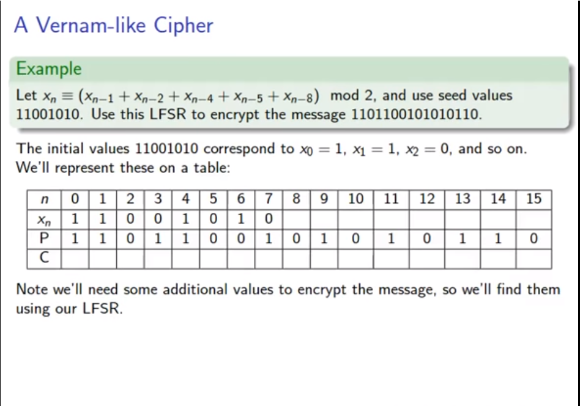
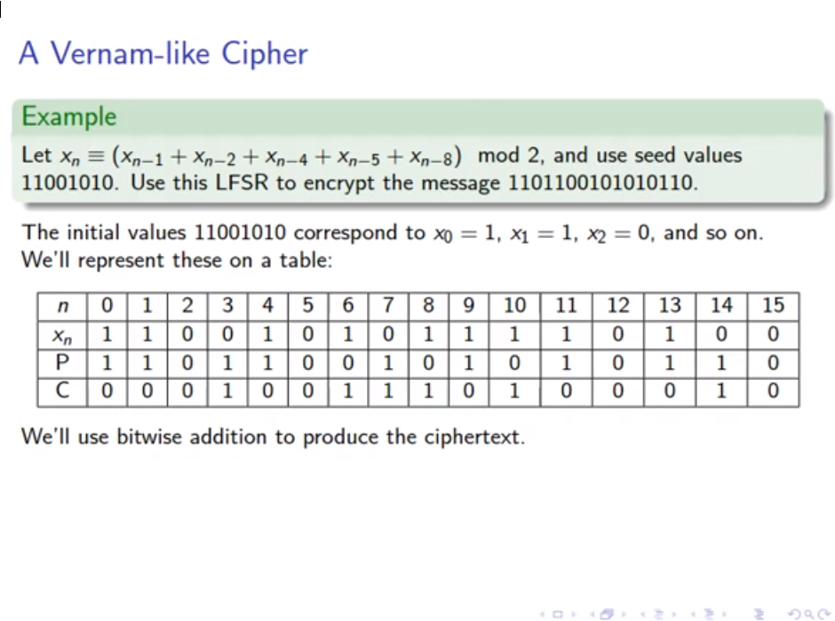

# 0CTF

## zer0lfsr

Este reto consiste en un cifrado de flujo usando una 
[LFSR.](https://en.wikipedia.org/wiki/Linear-feedback_shift_register)

En computación un LFSR (*linear-feedback shift register*) es un un registro de desplazamiento 
de una cascada de flip flops, que comparte el mismo reloj, en el que la salida de cada flip-flop
está conectada a la entrada de "datos" del siguiente flip-flop en la cadena,
lo que resulta en un circuito que cambia en una posición la "matriz de bits" almacenada en ella,
"cambiando" los datos presentes en su entrada y "desplazando" el último bit de la matriz, 
en cada transición de la entrada del reloj.

La forma más común de encontrar este tipo de algoritmo es con un XOR.

###LFSR en cryptografía.

Se usa para generar números pseudo-aleatorios para usarlos en su uso en cifrados de flujo

Un LFSR es un cryptosistema que lleva un criptoanálisis bastante fácil;
 Por ejemplo, dado un tramo de texto sin formato conocido y texto cifrado correspondiente, 
 un atacante puede interceptar y recuperar un tramo del flujo de salida LFSR utilizado en el sistema descrito,
 y desde ese tramo del flujo de salida puede construir un LFSR de tamaño mínimo que simule el
 receptor utilizando el algoritmo de Berlekamp-Massey. 
 Este LFSR puede luego alimentarse con el tramo interceptado del flujo de salida para
 recuperar el texto sin formato restante.

Se emplean tres métodos generales para reducir este problema en cifrados de flujo basados en LFSR:

* Combinación no lineal de varios bits del estado LFSR;
* Combinación no lineal de los bits de salida de dos o más LFSR (generador de contracción);
   o usar un algoritmo evolutivo para introducir la no linealidad.
* Cronometraje irregular del LFSR, como en el generador de pasos alternos.
  
Los cifrados de flujo importantes basados en LFSR incluyen A5/1 y A5/2, usados en teléfonos celulares GSM,
 E0, usados en Bluetooth y el generador de contracción. 
 El cifrado A5/2 se ha roto y tanto A5/1 como E0 tienen serias debilidades.

El registro de desplazamiento de realimentación lineal (**LFSR**)
 tiene una fuerte relación con los generadores lineales congruentes. 

**chall.py**
```python
from secret import init1,init2,init3,FLAG
import hashlib
assert(FLAG=="flag{"+hashlib.sha256(init1+init2+init3).hexdigest()+"}")

class lfsr():
    def __init__(self, init, mask, length):
        self.init = init
        self.mask = mask
        self.lengthmask = 2**(length+1)-1

    def next(self):
        nextdata = (self.init << 1) & self.lengthmask 
        i = self.init & self.mask & self.lengthmask 
        output = 0
        while i != 0:
            #^= operator XOR equal
            output ^= (i & 1)
            #Binary Right-Shift
            i = i >> 1
        nextdata ^= output
        self.init = nextdata
        return output

def combine(x1,x2,x3):
    return (x1*x2)^(x2*x3)^(x1*x3)

if __name__=="__main__":
    l1 = lfsr(int.from_bytes(init1,"big"),0b100000000000000000000000010000000000000000000000,48)
    l2 = lfsr(int.from_bytes(init2,"big"),0b100000000000000000000000000000000010000000000000,48)
    l3 = lfsr(int.from_bytes(init3,"big"),0b100000100000000000000000000000000000000000000000,48)

    with open("keystream","wb") as f:
        for i in range(8192):
            b = 0
            for j in range(8):
                b = (b<<1)+combine(l1.next(),l2.next(),l3.next())
            f.write(chr(b).encode())
```
El algoritmo usa tres independientes LFSR's y las combina mandándolos a *keystream*.
El objetivo es recuperar el estado inicial de cada uno de los generadores.

**solution.py**
```python
from z3 import *

class lfsr():
    def __init__(self, init, mask, length):
        self.init = init
        self.mask = mask
        #ELinear ecuation
        #The powers of two form a lenght linear recurrence relation
        self.lengthmask = 2**(length+1)-1
        self.length = length

    def next(self):
        nextdata = (self.init << 1) & self.lengthmask
        i = self.init & self.mask & self.lengthmask

        output = 0
        for j in range(self.length):
            output ^= (i & 1)
            i = i >> 1

        nextdata ^= output
        self.init = nextdata
        return output

def combine(x1,x2,x3):
    return (x1*x2)^(x2*x3)^(x1*x3)

init1 = BitVec('init1', 48)
init2 = BitVec('init2', 48)
init3 = BitVec('init3', 48)

l1 = lfsr(init1, 0b100000000000000000000000010000000000000000000000, 48)
l2 = lfsr(init2, 0b100000000000000000000000000000000010000000000000, 48)
l3 = lfsr(init3, 0b100000100000000000000000000000000000000000000000, 48)

s = Solver()
with open('decoded-keystream', 'rb') as f:
    keystream = f.read()

bits = 200
outputs = []
for b in keystream:
    arr = []
    tmp = b
    for i in range(8):
        arr += [tmp]
        tmp //= 2

    tmp = 0
    for l in arr[::-1]:
        outputs += [l - (tmp * 2)]
        tmp = l
    
for i in range(bits):
    s.add(outputs[i] == combine(l1.next(), l2.next(), l3.next()))
    #print(i)

s.check()
print(s.model())
```

**decoded-keystream**
```python
barr = b''
with open('keystream','rb') as f:
    data = f.read()
    i = 0
    while i < len(data):
        if data[i] == 194 or data[i] == 195:
            barr += bytes([ord(bytes([data[i], data[i+1]]).decode())])
            i += 1
        else:
            barr += bytes([ord(bytes([data[i]]).decode())])
        i += 1
with open('decoded-keystream', 'wb') as f:
    f.write(barr)
```

**solved.py**
```python
from Crypto.Util.number import long_to_bytes
from hashlib import sha256

flag = 'flag{' + sha256(long_to_bytes(70989122156399) + long_to_bytes(181037482648735) + long_to_bytes(191532558614761)).hexdigest() + '}'

print(flag)
```

### Cosas a notar

#### Vernam Cipher:

El Cifrado Vernam se basa en el principio de que cada carácter de texto simple 
 de un mensaje se "mezcla" con un carácter de un flujo clave.
 Si se utiliza un flujo de clave verdaderamente aleatorio,
 el resultado será un texto cifrado verdaderamente "aleatorio" que no guarda relación con el texto plano original.
 En ese caso, el cifrado es similar al One-Time Pad (OTP) irrompible.

El texto cifrado se genera aplicando la operación lógica XOR (o-exclusivo) a los bits individuales
 de texto simple y la secuencia clave. La ventaja de utilizar la operación XOR para esto, 
 es que se puede revertir, simplemente realizando la misma operación nuevamente. En otras palabras: 

texto simple + clave = texto cifrado ⇒ texto cifrado + clave = texto simple

Este proceso de aplicar la operación XOR al texto y la clave a menudo se denomina mezcla,
 y las máquinas de cifrado que utilizan el principio de Vernam, por lo tanto, se conocen como mezcladores.

Este [video](https://www.youtube.com/watch?v=8fhNPXus4-s&list=PLKXdxQAT3tCssgaWOy5vKXAR4WTPpRVYK&index=10)
 me aclaró varias dudas:

La idea general es esta:



